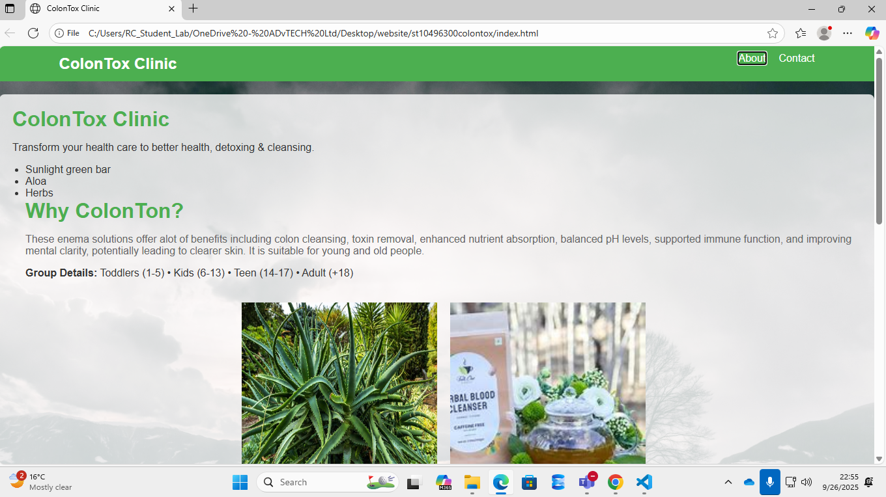
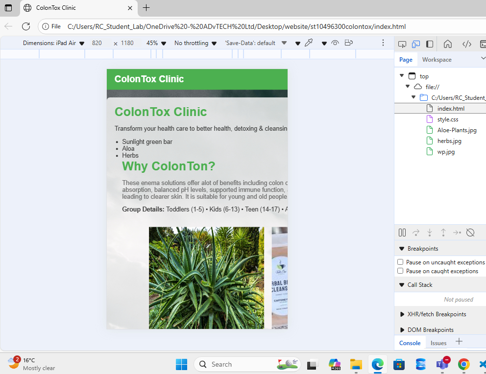
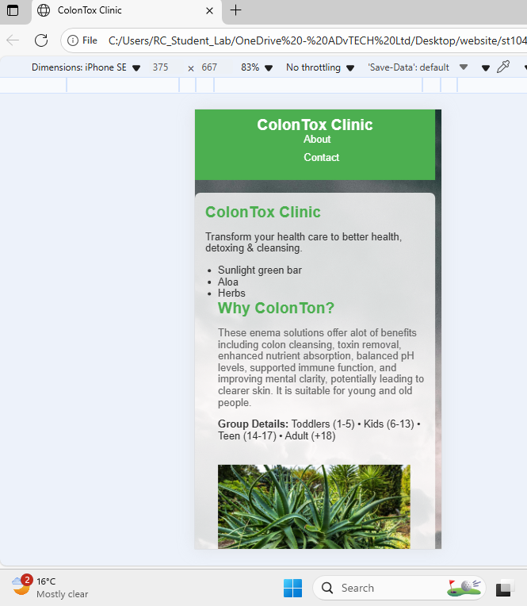

# ColonTox Clinic Website
 
This project is a website for ColonTox Clinic, focusing on health care, detoxing, and cleansing services. The website showcases the benefits of colon cleansing and provides contact information for demos.
 
## Change Log
 
### Part 2: Designing the Visuals - CSS Styling and Responsive Design
- **Date:** 2025-09-26
- **Changes:**
  - Created and linked an external CSS stylesheet (style.css) to index.html.
  - Implemented a CSS reset to ensure consistent styling across browsers.
  - Established base styles including font family (Arial), color scheme (green primary, white secondary, gray muted), and background with image.
  - Applied typography styles using font-size, font-weight, line-height, and letter-spacing for headings and paragraphs.
  - Created layout structure using CSS Flexbox for the about section and CSS Grid for the contact section.
  - Added visual styles including colors, borders, border-radius, and box-shadow for cards and elements.
  - Implemented pseudo-classes (:hover, :focus) for buttons and links to enhance interactivity.
  - Added responsive design using media queries with breakpoints at 768px and 480px for mobile devices, adjusting layouts to flex-direction column and grid to single column.
  - Ensured cascading nature of CSS by using variables and efficient selectors to minimize redundancy.
  - Added a simple navigation menu to HTML with links to sections.
  - Made navigation responsive: horizontal on desktop, vertical on mobile.
  - Used relative units like % for widths and basic px for simplicity.
  - Made images responsive by setting width to %.
  - Updated media queries for basic responsiveness.
 
## Screenshots
 
Include screenshots of the website at different screen sizes:
- Desktop (screen width > 768px)

- Tablet (screen width 768px to 480px)

- Mobile (screen width < 480px)

 
Screenshots should demonstrate the responsive layout, navigation menu adaptation, and image responsiveness.
 
## References
 
MDN Web Docs. (2023) *CSS: Cascading Style Sheets*. Available at: https://developer.mozilla.org/en-US/docs/Web/CSS (Accessed: 26 September 2025).
 
W3Schools. (2023) *CSS Tutorial*. Available at: https://www.w3schools.com/css/ (Accessed: 26 September 2025).
 
W3Schools. (2023) *CSS Flexbox*. Available at: https://www.w3schools.com/css/css3_flexbox.asp (Accessed: 26 September 2025).
 
W3Schools. (2023) *CSS Grid*. Available at: https://www.w3schools.com/css/css_grid.asp (Accessed: 26 September 2025).
 
W3Schools. (2023) *CSS Media Queries*. Available at: https://www.w3schools.com/css/css3_mediaqueries.asp (Accessed: 26 September 2025).
 
 PROROZ (2021) How To Create A Website using HTML & CSS | Step-by-Step Tutorial. YouTube, 23 March. Available at: https://www.youtube.com/watch?v=CQZxeoQeo5c (Accessed: 26 September 2025).